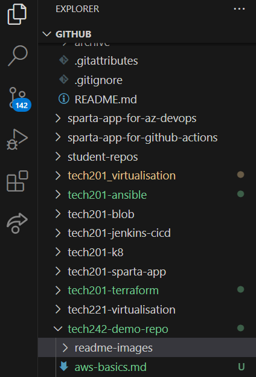

# Week 1 - AWS and Linux

- [Week 1 - AWS and Linux](#week-1---aws-and-linux)
  - [Day 1 - Intro to cloud \& AWS](#day-1---intro-to-cloud--aws)
  - [Day 2](#day-2)
  - [Learning how to do highlight code](#learning-how-to-do-highlight-code)

<br>

## Day 1 - Intro to cloud & AWS

- [What is cloud](what-is-cloud)
  - The above link goes to the folder
  - Going to the folder also shows the default file `README.md` in that folder
- [AWS basics](aws-basics/README.md)
  - The above link goes straight to a file

## Day 2

Some more notes

Example of how to include an image in your documentation:<br>



## Learning how to do highlight code

This is code in the same line: `cd <directory>`

This is a multi-line code block: 
```
cd <directory>
ls
```